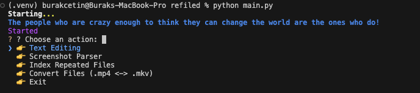

# 📁 refiled



**refiled** is a modular, asynchronous CLI-based file management and renaming tool designed for power users working with large media collections (e.g., `.mp4`, `.mkv`). It supports advanced text editing, batch renaming, pirate-style formatting, prefixing, undo, and intelligent indexing—all with an interactive CLI interface.

---

## 🧱 Project Structure

```
refiled/
├── main.py                  # Entry point: boots up the CLI, prints startup banners, and launches the main CLI loop
├── requirements.txt         # All Python dependencies
├── README.md                # Full documentation
├── rfld_image.png           # Demo image for README
├── refiled/
│   ├── cli.py               # Main CLI orchestration: menus, prompts, dispatching ops, tracking duration, undo prompts
│   ├── utilities.py         # Shared helper functions: renaming, extension checks, formatting, etc.
│   ├── filesystem/
│   │   ├── navigator.py     # Recursive folder navigation with emoji UI + path resolution + directory tree logic
│   │   ├── validator.py     # Validates and sanitizes selected paths
│   ├── operations/
│   │   ├── add_remove.py        # Add or remove any substring from filenames (start/end); supports filtered mode
│   │   ├── move.py              # Move phrases inside filenames (from anywhere to start/end); experimental logic
│   │   ├── pirate.py            # Pirate-style formatter: dot lowercase & reverses to Title Case
│   │   ├── prefix.py            # Add or remove consistent prefixes from files (start/end), supports filtering
│   │   ├── remove_brackets.py   # Remove brackets and normalize whitespace around them
│   │   ├── convert.py           # Convert file extensions between .mp4 and .mkv
│   │   ├── indexer.py           # Detect & group similar files into [indexed]/ folders based on word patterns
│   │   ├── screenshot_parser.py # Match screenshots with video files alphabetically and rename accordingly
│   │   ├── search.py            # Fuzzy and reversed matching support across all operations
│   │   ├── undo.py              # Global undo stack and rollback mechanism for all operations
│   │   ├── low_caps.py          # Convert filenames to ALL CAPS or all lowercase (excluding file extensions)
```

---

## ✨ Features

1. 🔍 **Interactive Folder Selection**  
   Navigate with arrow keys through Downloads, Desktop, Documents, and custom paths. Uses a clean, recursive folder browser with emoji-labeled directories.

2. 📝 **Add/Remove Text**  
   Append or strip any string to/from the start or end of filenames. Supports fuzzy and reversed matching for flexible targeting.

3. 🔁 **Move Text (Experimental)**  
   Move a chosen phrase or word within a filename from start to end or vice versa. Still under refinement—may yield edge case issues.

4. ☠️ **Pirate/Normalize Formatting**  
   Convert space-based titles to dot-separated lowercase (`my.movie.title`) and reverse back into capitalized titles (`My Movie Title`).

5. ➕ **Add/Remove Prefix**  
   Insert or delete consistent prefixes from a batch of filenames for better grouping or classification.

6. 🧽 **Bracket Cleaner**  
   Removes unnecessary brackets like `[`, `(`, `{` while preserving enclosed content, cleaning up cluttered filenames.

7. 🔄 **Undo System**  
   Every rename operation can be reverted instantly via tracked history. Even index-based group moves are reversible.

8. 📂 **Index Repeated Files**  
   Detects and groups files with repeated phrases (like `Part 1`, `Part 2`) into `[indexed]/Phrase/` folders for organized browsing.

9. 🖼️ **Screenshot Parser**  
   Matches screenshots (`.png`, `.jpg`) to video files alphabetically, renaming screenshots to match corresponding video names for easy association.

10. 🔁 **MP4/MKV Extension Converter**  
    Converts file extensions from `.mp4` to `.mkv` (or vice versa) for batches of media with consistent structure.

11. 🧠 **Fuzzy + Reversed Matching**  
    All operations support intelligent fuzzy and reversed matching to broaden match flexibility.

12. ⚡ **Async & Parallel Execution**  
    Uses `asyncio` and `ThreadPoolExecutor` for lightning-fast batch processing even on large file sets.

13. 🧮 **Filtered Operations (All/Specific)**  
    All major operations (prefix, move, add/remove) allow targeting "all files" or filtering with a search term. Matching supports fuzzy and reversed options.

14. 🕓 **Execution Time Display**  
    Each operation displays how long it took in milliseconds, giving you visibility into CLI performance.

15. 🧪 **Middle-to-Start Text Movement**  
    The "Move Text" operation now supports moving phrases from anywhere in a filename (even in the middle), not just edges.

16. 📤 **Multi-Step Folder Prompts**  
    Screenshot parser now guides you with sequential prompts: step-by-step folder selections and confirmation dialogs.

17. 📁 **Smart Folder Ordering**  
    Common folders like Downloads, Desktop, and Movies are sorted and prioritized in navigation.

18. 🔠 **All Caps / Lowercase Formatting**  
    Converts all filenames to full uppercase or full lowercase (excluding extensions).  
    Useful for stylistic or batch normalization purposes. Operates safely around special characters and preserves extension casing.

---

## 🧪 Examples

**Pirate format:**
```
Original: My Movie Trailer.mp4
Pirated : my.movie.trailer.mp4
```

**Normalize format:**
```
Original: my.movie.trailer.mp4
Cleaned : My Movie Trailer.mp4
```

**Add/Remove Text:**
```
Original: Movie_Trailer.mp4
Action  : Add "_HD" to end
Result  : Movie_Trailer_HD.mp4
```

**Move Text:**
```
Original: 2023_Movie_Final.mp4
Action  : Move "Final" to start
Result  : Final_2023_Movie.mp4
```

**Prefix Management:**
```
Original: Movie_Trailer.mp4
Action  : Add prefix "NEW_"
Result  : NEW_Movie_Trailer.mp4
```

**Bracket Cleaner:**
```
Original: Movie [HD] (2023).mp4
Result  : Movie HD 2023.mp4
```

**Screenshot Parser:**
```
video1.mp4 → video1.jpg
video2.mp4 → video2.jpg
```

**MP4/MKV Converter:**
```
video1.mp4 → video1.mkv
```

**Indexing:**
- Detects common repeated 2-3 word phrases
- Groups files under `[indexed]/Phrase_Name/`

**Filtered Rename (Prefix Specific):**
```
Files: wow_movie.mp4, boring_clip.mp4
Action: Add prefix "WOW_" to files containing "wow"
Result: WOW_wow_movie.mp4, boring_clip.mp4
```

**Move From Middle to Start:**
```
Original: My Video Fight Club 2023.mp4
Move: "Fight Club" to start
Result: Fight Club My Video 2023.mp4
```

---

## 🔍 Matching Options Explained

**Also match reversed order?**  
- This option checks for the phrase in both forward and reversed order.  
- Example: Searching for `"steve jobs"` will also match `"jobs steve"` if enabled.

**Enable fuzzy matching?**  
- Allows approximate or partial matches using similarity scoring.  
- Example: `"mov trailer"` can match `"Movie_Trailer_2023.mp4"` or `"mov.triler.v2.mkv"`  
- Useful for typos, variations, or loosely structured filenames.

These options are available in operations like **Add/Remove Text**, **Prefix**, and **Move Text** when filtering files.

---

## 📦 Installation

1. **Clone the repo**
```bash
git clone https://github.com/burakcetindev/refiled.git
cd refiled
```

2. **Set up virtual environment**
```bash
python3 -m venv .venv
source .venv/bin/activate
```

3. **Install dependencies**
```bash
pip install -r requirements.txt

#(First time only) Download NLTK stopwords:
python -m nltk.downloader stopwords
```

---

## 🚀 Usage

Run the CLI:

```bash
python main.py
```

Use arrow keys to navigate folders, select operations, and interact with prompts.

Folder navigation supports:
- Downloads, Desktop, Documents, Movies
- Back to main menu from anywhere
- Custom path entry

---

## 📄 License

MIT License — free to use, modify, and distribute.

## 🤝 Contribution

Contributions, suggestions, and bug reports are welcome!  
Feel free to open issues or submit pull requests.

## 🤖 Support & Feedback

For support or feature requests, please open an issue in the repository.

Thank you for using the Video File Utility Toolkit!  
Happy organizing and hacking your media library 🎥✨  

---

## 📅 Planned Future Features (TBI 'In Due Time')

1. Extract location and timestamp data from video metadata.

2. Rename and organize files chronologically and geographically for better management.

3. Automated Cover Image Generation:  
   - Generate 3 to 5 potential cover images per video.  
   - Use OpenCV with machine learning or FFmpeg for frame extraction.  
   - Interactive selection of the best cover image for each video.

---
